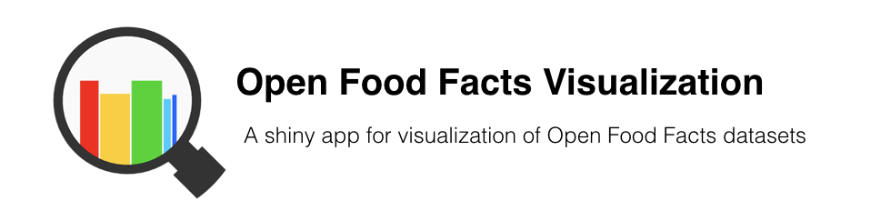

#### Data Source: 

[Open Food Facts](https://world.openfoodfacts.org/) is a free, open, collbarative database of food products from around the world, with ingredients, allergens, nutrition facts and all the tidbits of information we can find on product labels.It is a non-profit association of volunteers. 

By now, 5000+ contributors have added 100 000+ products from 150 countries using our Android, iPhone or Windows Phone app or their camera to scan barcodes and upload pictures of products and their labels.

***

#### Tools:

* Built using Shiny by RStudio

* Code available on [GitHub](https://github.com/iamchuan?tab=repositories)

***

&copy; Chuan Hong [LinkedIn](https://www.linkedin.com/in/iamchuan/) 